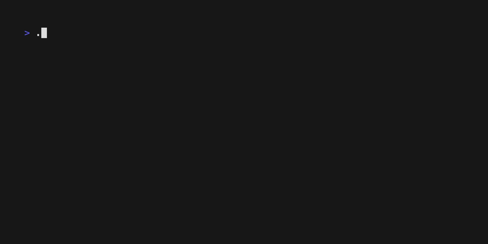

# miniCC

A simple compiler for a subset of the C programming language.

This project aims to implement a complete compilation pipeline, including
lexical analysis, parsing, semantic analysis, and code generation for a
simplified C grammar.


## Demo


## Build and run

Move into the `minicc` subdirectory and build there; executables go into
`minicc/bin/`.

```sh
cd minicc
# compile by using the provided Makefile
make
```

Run the program with an optional file argument (from the same `minicc`
directory). The binary will be located in `bin/`:

```sh
bin/minicc [options] [path/to/file.c]
```

### Options

- `-v`, `--verbose`: Enable visual debugging. Prints the Source-Token Map and the ASCII AST Tree.

If no file is given, it uses `examples/simple.c` by default.

### Running Tests

To automatically run the compiler against all files in the `examples/` directory:

```sh
make test
```

## Supported Features

- **Data Types**: `int`, `void`.
- **Variable Declarations**: Local and global variables.
- **Statements**: Expression statements, block statements `{ ... }`.
- **Control Flow**: `if`, `else`, `while`, `return`.
- **Functions**: Function definition, function declaration, function calls (including recursion).
- **Operators**:
    - **Arithmetic**: `+`, `-`, `*`, `/`.
    - **Comparison**: `==`, `!=`, `<`, `>`, `<=`, `>=`.
    - **Assignment**: `=`.

## Project layout

```
minicc/             # build directory containing sources and Makefile
minicc/src/         # C++ source files
examples/simple.c              # simple sample
examples/arithmetic.c          # arithmetic expressions
examples/control.c             # loops and conditionals
examples/comments.c            # single- and multi-line comments
examples/error.c               # syntax error
examples/recursion.c           # function call with recursion
```

## Roadmap

To evolve this toy into a simple compiler, the rough stages would be:

1. ✅ **Lexical Analysis** – take source code and convert it into a stream of tokens.
2. ✅ **Parsing** – take token stream and build an abstract syntax tree (AST).
   use recursive-descent or table-driven parser; the `parser` class
   should be fleshed out.
3. ☑️ **Semantic analysis** – traverse AST, check types, scopes, declarations,
   resolve identifiers, detect errors.
4. 👷‍♂️ **Intermediate representation** – convert AST to IR (e.g. three-address
   code) for easier optimization and code generation.
5. ☑️ **Optimization** – perform basic transformations like constant folding,
   dead code elimination, or simple register allocation.
6. ☑️ **Code generation** – emit target code (assembly, bytecode, etc.).
   could start with simple x86-64 or use LLVM as backend.
